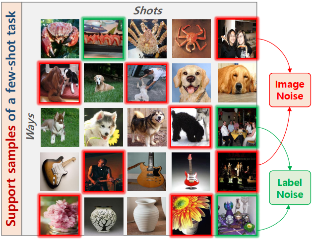
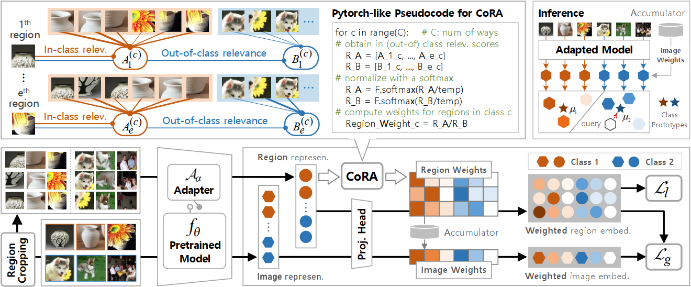
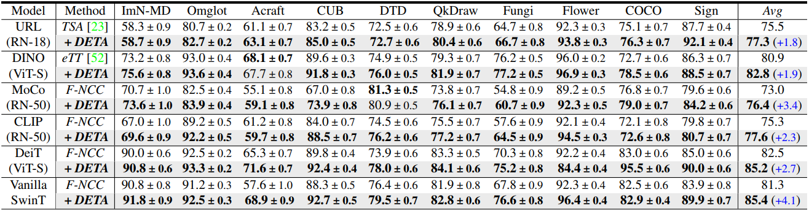
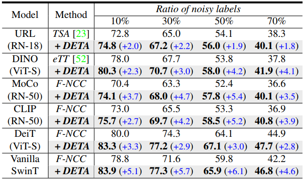
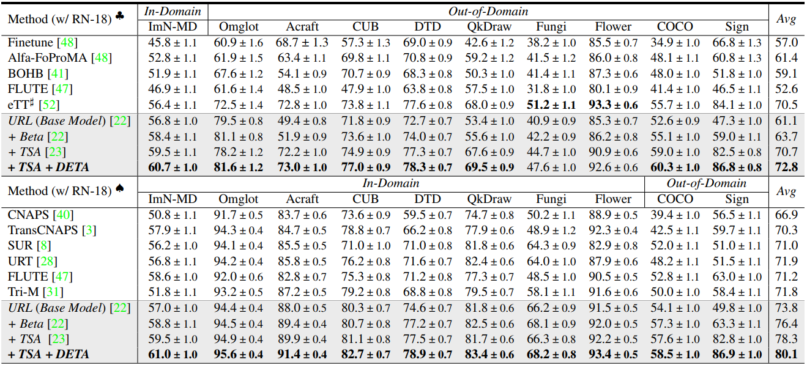
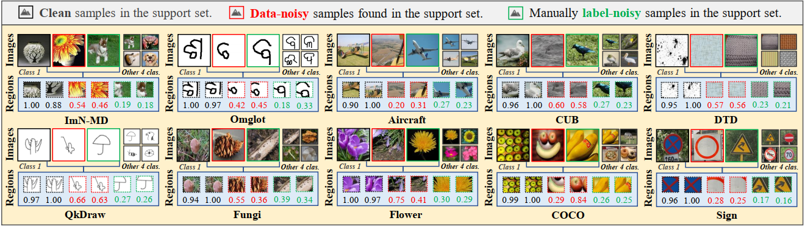
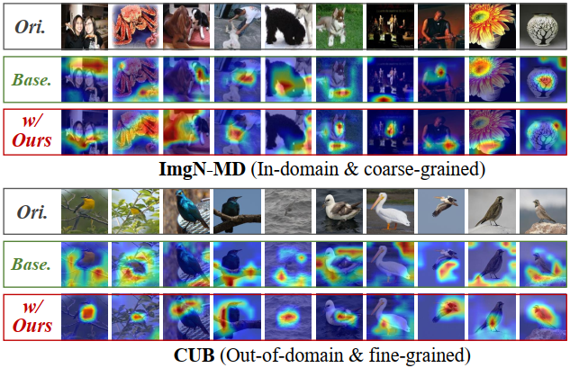

# DETA: Denoised Task Adaptation for Few-Shot Learning
## Abstract
Test-time task adaptation in few-shot learning aims to adapt a pre-trained task-agnostic model for capturing task-specific knowledge of the test task, rely only on few-labeled support samples. Previous attempts  generally focus on developing advanced algorithms to achieve the goal, while neglecting the inherent problems of the given support samples. In fact, with only a handful of samples available, the adverse effect of either the image noise (a.k.a. X-noise) or the label noise (a.k.a. Y-noise) from support samples can be severely amplified. To tackle the problem, in this work we propose DEnoised Task Adaptation (DETA), a unified image- and label-denoising framework orthogonal to existing task adaptation approaches. Without extra supervision, DETA filters out task-irrelevant (i.e. noisy) global and local representations by taking advantage of both global visual information and local region details of support samples. On the challenging Meta-Dataset, DETA consistently improves the performance of a broad spectrum of baseline methods applied on various pre-trained models. Notably, by tackling the overlooked image noise in Meta-Dataset, DETA establishes new state-of-the-art results. 

<p align="center">
  
</p>
 
## Overview
An overview of the proposed DETA (in a 2-way 3-shot exemple). During each iteration of task adaptation, the images together with a collection of cropped local regions of the support samples are first fed into a pre-trained model to extract image and region representations. Next, a Contrastive Relevance Aggregation(CoRA) module takes the region representations as input to determine the weight of each region, based on which we can calculate the image weights by a momentum accumulator. Finally, a local compactness loss and a global dispersion loss are devised in a weighted embedding space for noise-robust representation learning. At inference, we only retain the adapted model to produce image representations of support samples, on which we build a classifier guided by the refined image weights from the accumulator. 
<p align="center">
  
</p>


## Contributions
- We propose DETA, a first, unified image- and label-denoising framework for FSL.

- DETA can be flexibly plugged into different adapter-based and finetuning-based task adaptation paradigms.

- Extensive experiments on Meta-Dataset demonstrate the effectiveness and flexibility of DETA.

## Strong Performance
- Image-denoising on vanilla Meta-dataset
<p align="center">
  
</p>

- Label-denoising on label-corrupted Meta-dataset
<p align="center">
  
</p>

- State-of-the-art Comparison
<p align="center">
  
</p>

## Visualization
- Visualization of the cropped regions and calculated weights by CoRA.
<p align="center">
  
</p>

- CAM visualization.
<p align="center">
  
</p>

## Dependencies
* Python 3.6 or greater
* PyTorch 1.0 or greater
* TensorFlow 1.14 or greater

## Datasets
* Clone or download this repository.
* Follow the "User instructions" in the [Meta-Dataset repository](https://github.com/google-research/meta-dataset) for "Installation" and "Downloading and converting datasets".
* Edit ```./meta-dataset/data/reader.py``` in the meta-dataset repository to change ```dataset = dataset.batch(batch_size, drop_remainder=False)``` to ```dataset = dataset.batch(batch_size, drop_remainder=True)```. (The code can run with ```drop_remainder=False```, but in our work, we drop the remainder such that we will not use very small batch for some domains and we recommend to drop the remainder for reproducing our methods.)

## Pretrained Models
- [URL (RN-18)](https://github.com/VICO-UoE/URL)

- [DINO (ViT-S)](https://github.com/facebookresearch/dino)

- [MoCo-v2 (RN-50)](https://github.com/facebookresearch/moco)

- [CLIP (RN-50)](https://github.com/OpenAI/CLIP)

- [Deit (ViT-S)](https://github.com/facebookresearch/deit)

- [Swin Transformer (Tiny)](https://github.com/microsoft/Swin-Transformer)

## Initialization
* Before doing anything, first run the following commands.
    ```
    ulimit -n 50000
    export META_DATASET_ROOT=<root directory of the cloned or downloaded Meta-Dataset repository>
    export RECORDS=<the directory where tf-records of MetaDataset are stored>
    ```
* Enter the root directory of this project, i.e. the directory where this project was cloned or downloaded.


## Task Adaptation
Specify a pretrained model to be adapted, and execute the following command.
* Baseline
    ```
    python main.py --pretrained_model=MOCO --maxIt=40 --ratio=0. --test.type=10shot
    ```
* Ours
    ```
    python main.py --pretrained_model=MOCO --maxIt=40 --ratio=0. --test.type=10shot --ours --n_regions=2
    ```
 Note: set ratio=0. for image-denoising, set  0. < ratio < 1.0 for label-denoising.


## References
<div style="text-align:justify; font-size:80%">
    <p>
        [1] Eleni Triantafillou, Tyler Zhu, Vincent Dumoulin, Pascal Lamblin, Utku Evci, Kelvin Xu, Ross Goroshin, Carles Gelada, Kevin Swersky, Pierre-Antoine Manzagol, Hugo Larochelle; <a href="https://arxiv.org/abs/1903.03096">Meta-Dataset: A Dataset of Datasets for Learning to Learn from Few Examples</a>; ICLR 2020.
    </p>
    <p>
        [2] Li, Wei-Hong and Liu, Xialei and Bilen, Hakan; <a href="https://arxiv.org/abs/2107.00358">Cross-domain Few-shot Learning with Task-specific Adapters</a>; CVPR 2022.
    </p>
    <p>
        [3] Xu, Chengming and Yang, Siqian and Wang, Yabiao and Wang, Zhanxiong and Fu, Yanwei and Xue, Xiangyang; <a href="https://openreview.net/pdf?id=n3qLz4eL1l">Exploring Efficient Few-shot Adaptation for Vision Transformers</a>; Transactions on Machine Learning Research 2022.
    </p>
    <p>
        [4] Liang, Kevin J and Rangrej, Samrudhdhi B and Petrovic, Vladan and Hassner, Tal; <a href="https://openaccess.thecvf.com/content/CVPR2022/papers/Liang_Few-Shot_Learning_With_Noisy_Labels_CVPR_2022_paper.pdf">Few-shot learning with noisy labels</a>; CVPR 2022.
    </p>
    <p>
        [5] Chen, Pengguang, Shu Liu, and Jiaya Jia; <a href="http://openaccess.thecvf.com/content/CVPR2021/papers/Chen_Jigsaw_Clustering_for_Unsupervised_Visual_Representation_Learning_CVPR_2021_paper.pdf">Jigsaw clustering for unsupervised visual representation learning</a>; CVPR 2020.
    </p>

</div>


## Acknowledge
We thank authors of [Meta-Dataset](https://github.com/google-research/meta-dataset), [URL/TSA](https://github.com/VICO-UoE/URL), [eTT](https://github.com/loadder/eTT_TMLR2022), [JigsawClustering](https://github.com/dvlab-research/JigsawClustering) for their source code. 

