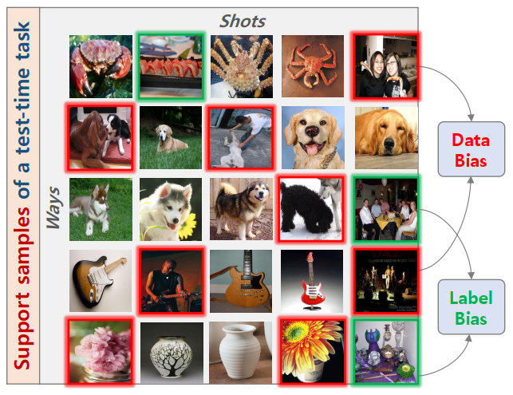
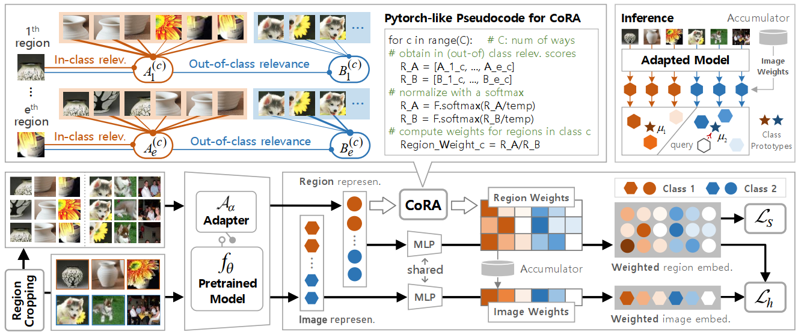
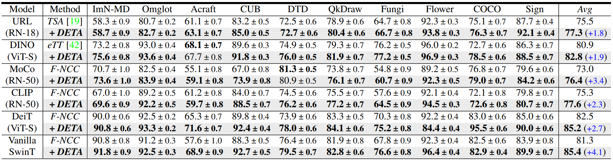
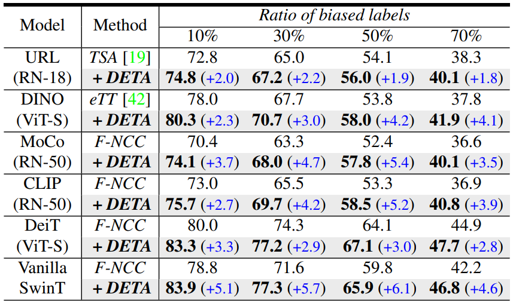
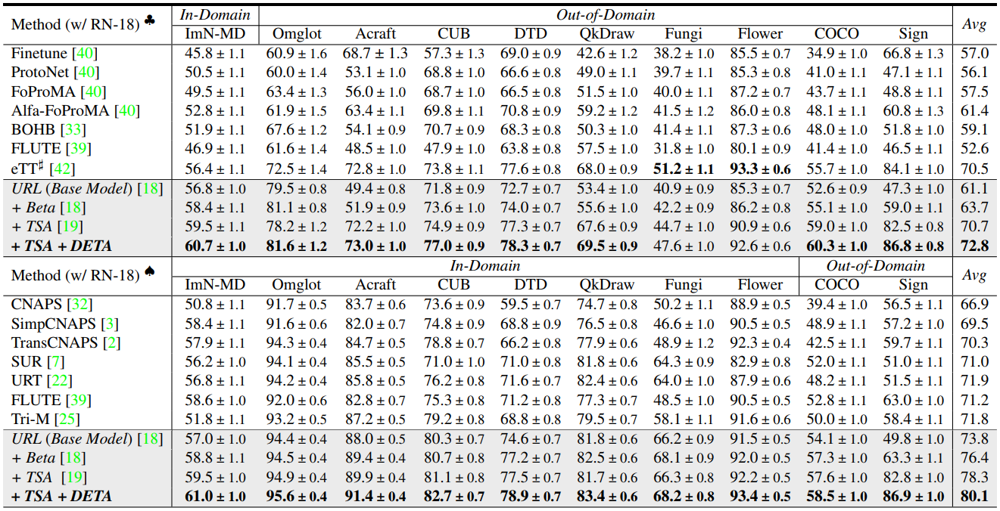

# DETA: Debiased Task Adaptation for Few-Shot Learning
## Abstract
Test-time task adaptation in few-shot learning aims to adapt a pre-trained task-agnostic model for capturing taskspecific knowledge of the test task, relying on few-labeled support samples. Previous paradigms generally focus on developing advanced algorithms to achieve the goal, while neglecting the inherent problems of the given support samples. In fact, with only a handful of samples available, the adverse effect of inevitable support bias, i.e., data and label bias from support samples, can be severely amplified. To circumvent the problem, in this work we propose DEbiased Task Adaptation (DETA), a unified dataand label-debiasing framework orthogonal to existing task adaptation approaches. Without extra supervision, DETA filters out task-irrelevant (a.k.a, biased) global and local representations by taking advantage of both global visual information and local region details of support samples. On the challenging Meta-Dataset, DETA consistently improves the performance of a broad spectrum of baseline methods applied on various pre-trained models. Notably, by tackling the overlooked data bias in Meta-Dataset, DETA establishes new state-of-the-art results.

<p align="center">
  
</p>
 
## Overview
An overview of the proposed DETA (in a 2-way 3-shot exemple). During each iteration of task adaptation, the images together with a collection of cropped local regions of the support samples are first fed into a pre-trained model to extract image and region representations. Next, a Contrastive Relevance Aggregation(CoRA) module takes the region representations as input to determine the weight of each region, based on which we can calculate the image weights by a momentum accumulator. Finally, a Supervised Soft-Clustering (SS-CL) loss and a Hybrid Soft-ProtoNet (HS-PN) loss are devised in a weighted embedding space for bias-robust representation learning. At inference, we only retain the adapted model to produce image representations of support samples, on which we build a classifier guided by the refined image weights from the accumulator. 
<p align="center">
  
</p>


## Contributions
- We uncover the overlooked support bias problem in test-time task adaptation, and propose DETA to resolve the two types of support bias (i.e., data and label bias) in a unified framework.

- DETA can be flexibly plugged into different adapter-based and finetuning-based task adaptation paradigms.

- Extensive experiments on Meta-Dataset demonstrate the effectiveness and flexibility of DETA.

## Strong Performance
- Data-debiasing on vanilla Meta-dataset
<p align="center">
  
</p>

- Label-debiasing on label-corrupted Meta-dataset
<p align="center">
  
</p>

- State-of-the-art Comparison
<p align="center">
  
</p>


# Implementation Guidance. 

## Dependencies
* Python 3.6 or greater
* PyTorch 1.0 or greater
* TensorFlow 1.14 or greater

## Datasets
* Clone or download this repository.
* Follow the "User instructions" in the [Meta-Dataset repository](https://github.com/google-research/meta-dataset) for "Installation" and "Downloading and converting datasets".
* Edit ```./meta-dataset/data/reader.py``` in the meta-dataset repository to change ```dataset = dataset.batch(batch_size, drop_remainder=False)``` to ```dataset = dataset.batch(batch_size, drop_remainder=True)```. (The code can run with ```drop_remainder=False```, but in our work, we drop the remainder such that we will not use very small batch for some domains and we recommend to drop the remainder for reproducing our methods.)

## Pretrained Models
- [URL (RN-18)](https://github.com/VICO-UoE/URL)

- [DINO (ViT-S)](https://github.com/facebookresearch/dino)

- [MoCo-v2 (RN-50)](https://github.com/facebookresearch/moco)

- [CLIP (RN-50)](https://github.com/OpenAI/CLIP)

- [Deit (ViT-S)](https://github.com/facebookresearch/deit)

- [Swin Transformer (Tiny)](https://github.com/microsoft/Swin-Transformer)

## Initialization
1. Before doing anything, first run the following commands.
    ```
    ulimit -n 50000
    export META_DATASET_ROOT=<root directory of the cloned or downloaded Meta-Dataset repository>
    export RECORDS=<the directory where tf-records of MetaDataset are stored>
    ```
2. Enter the root directory of this project, i.e. the directory where this project was cloned or downloaded.


## Task Adaptation
Specify a pretrained model to be adapted.  Execute the following command in the root directory of this project:
    ```
    ./scripts/train_resnet18_sdl.sh
    ```
    
<div style="text-align:justify; font-size:80%">
    <p>
        [1] Eleni Triantafillou, Tyler Zhu, Vincent Dumoulin, Pascal Lamblin, Utku Evci, Kelvin Xu, Ross Goroshin, Carles Gelada, Kevin Swersky, Pierre-Antoine Manzagol, Hugo Larochelle; <a href="https://arxiv.org/abs/1903.03096">Meta-Dataset: A Dataset of Datasets for Learning to Learn from Few Examples</a>; ICLR 2020.
    </p>
    <p>
        [2] James Requeima, Jonathan Gordon, John Bronskill, Sebastian Nowozin, Richard E. Turner; <a href="https://arxiv.org/abs/1906.07697">Fast and Flexible Multi-Task Classification Using Conditional Neural Adaptive Processes</a>; NeurIPS 2019.
    </p>
    <p>
        [3] Peyman Bateni, Raghav Goyal, Vaden Masrani, Frank Wood, Leonid Sigal; <a href="https://openaccess.thecvf.com/content_CVPR_2020/html/Bateni_Improved_Few-Shot_Visual_Classification_CVPR_2020_paper.html">Improved Few-Shot Visual Classification</a>; CVPR 2020.
    </p>
    <p>
        [4] Peyman Bateni, Jarred Barber, Jan-Willem van de Meent, Frank Wood; <a href="https://openaccess.thecvf.com/content/WACV2022/papers/Bateni_Enhancing_Few-Shot_Image_Classification_With_Unlabelled_Examples_WACV_2022_paper.pdf">Enhancing Few-Shot Image Classification with Unlabelled Examples</a>; WACV 2022.
    </p>
    <p>
        [5] Nikita Dvornik, Cordelia Schmid, Julien Mairal; <a href="ttps://arxiv.org/abs/2003.09338">Selecting Relevant Features from a Multi-domain Representation for Few-shot Classification</a>; ECCV 2020.
    </p>
    <p>
        [6] Lu Liu, William Hamilton, Guodong Long, Jing Jiang, Hugo Larochelle; <a href="https://arxiv.org/abs/2006.11702">Universal Representation Transformer Layer for Few-Shot Image Classification</a>; ICLR 2021.
    </p>
    <p>
        [7] Eleni Triantafillou, Hugo Larochelle, Richard Zemel, Vincent Dumoulin; <a href="https://arxiv.org/pdf/2105.07029.pdf">Learning a Universal Template for Few-shot Dataset Generalization</a>; ICML 2021.
    </p>
    <p>
        [8] Yanbin Liu, Juho Lee, Linchao Zhu, Ling Chen, Humphrey Shi, Yi Yang; <a href="https://openaccess.thecvf.com/content/ICCV2021/papers/Liu_A_Multi-Mode_Modulator_for_Multi-Domain_Few-Shot_Classification_ICCV_2021_paper.pdf">A Multi-Mode Modulator for Multi-Domain Few-Shot Classification</a>; ICCV 2021.
    </p>
    <p>
        [9] Tonmoy Saikia, Thomas Brox, Cordelia Schmid; <a href="https://arxiv.org/abs/2001.07926">Optimized Generic Feature Learning for Few-shot Classification across Domains</a>; arXiv 2020.
    </p>
    <p>
        [10] Carl Doersch, Ankush Gupta, Andrew Zisserman; <a href="https://arxiv.org/abs/2007.11498">CrossTransformers: spatially-aware few-shot transfer</a>; NeurIPS 2020.
    </p>
</div>


## Acknowledge
We thank authors of [Meta-Dataset](https://github.com/google-research/meta-dataset), [SUR](https://github.com/dvornikita/SUR), [Residual Adapter](https://github.com/srebuffi/residual_adapters) for their source code. 

## Contact
For any question, you can contact [Wei-Hong Li](https://weihonglee.github.io).
